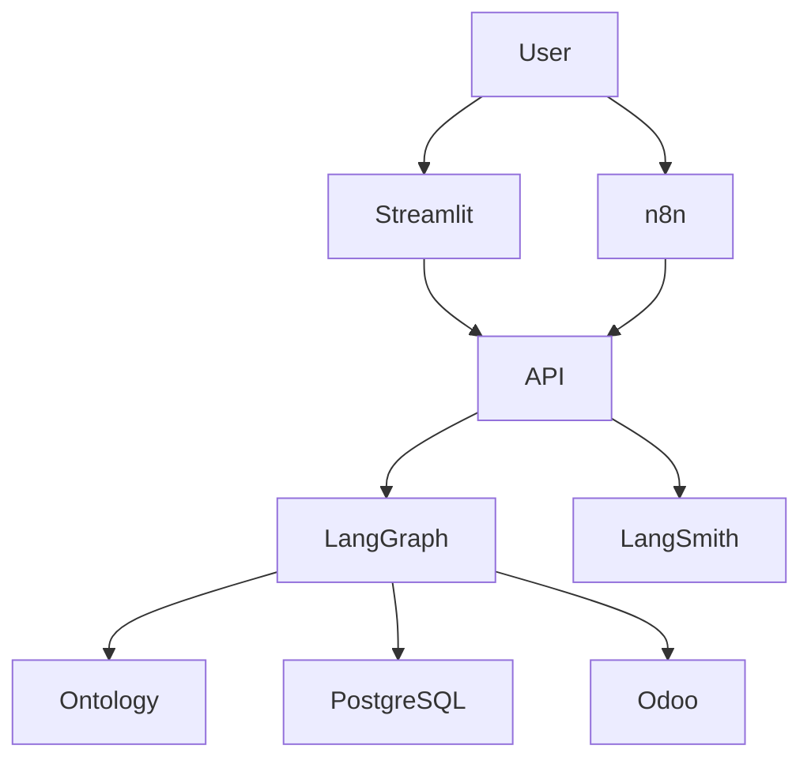

# JARVI 2.0.03 — Agente Cognitivo de Preventa Técnica para AISA Solar

> Arquitectura de agente cognitivo con persistencia de estado serializable, orquestación mediante grafos deterministas, gobernanza forense de eventos auditables y canales de consumo desacoplados.


---

## Tabla de Contenidos

- [Resumen Ejecutivo](#resumen-ejecutivo)
- [Arquitectura Modular](#arquitectura-modular)
- [Variables de Entorno](#variables-de-entorno)
- [Canales de Implementación](#canales-de-implementacion)
- [Pruebas de Caja Negra](#pruebas-de-caja-negra)
- [Análisis Ontológico y Epistemológico](#analisis-ontologico-y-epistemologico)
- [Referencias Técnicas](#referencias-tecnicas)
- [Roadmap](#roadmap)

---

## Resumen Ejecutivo

**JARVI 2.0.03** es la evolución de la arquitectura de razonamiento agéntico de AISA Solar, diseñada para la preventa técnica fotovoltaica.

El sistema desacopla completamente:

- Canal Web Humano (Streamlit)
- Automatización (n8n)
- Evaluación (LangSmith)

Toda la lógica de negocio reside en una API central basada en:

- LangGraph
- PostgreSQL
- FastAPI
- Ontologías técnicas
- Auditoría trazable

---

## Arquitectura Modular

| Componente | Función |
|---|---|
| `api.py` | Servidor central de lógica |
| `agent_graph.py` | Cerebro del agente |
| `streamlit_app.py` | UI web |
| `ontology.py` | Ruteo epistemológico |
| `catalog_ontology.json` | Fuente de verdad |
| `odoo_client.py` | Integración ERP |
| `audit.py` | Auditoría |
| `config.py` | Variables de entorno |
| `db_migrate.py` | Migraciones DB |
| `schemas.py` | Contratos de datos |
| `vision.py` | OCR de facturas |

---

## Arquitectura Lógica



---

## Variables de Entorno

### Backend (`cliente-api`)

| Variable | Propósito |
|---|---|
| `CHATBOT_MASTER_API_KEY` | Autenticación |
| `OPENAI_API_KEY` | LLM |
| `DATABASE_URL` | PostgreSQL |
| `LANGCHAIN_API_KEY` | LangSmith |
| `LANGCHAIN_PROJECT` | Proyecto |
| `LANGCHAIN_TRACING_V2` | Trazabilidad |

### Frontend (`cliente-humano`)

| Variable | Propósito |
|---|---|
| `BACKEND_URL` | Endpoint API |
| `CHATBOT_MASTER_API_KEY` | Token API |

---

## Canales de Implementación

---

### 1. Streamlit

Canal de interacción humano.

Características:

- chat web
- voz
- TTS
- OCR de facturas

---

### 2. n8n

Automatización vía webhook.

Ejemplo:

```json
{
  "thread_id": "uuid",
  "message": "Hola necesito paneles solares"
}
```

Headers:

```txt
Authorization: Bearer API_KEY
Content-Type: application/json
```

---

### 3. LangSmith

Usado para:

- debugging
- trazabilidad
- evaluación de prompts
- benchmarking

---

## Pruebas de Caja Negra

| ID | Prueba | Resultado Esperado |
|---|---|---|
| BC-T01 | Conversación On-Grid | Clasificación correcta |
| BC-T02 | Conversación Off-Grid | Persistencia correcta |
| BC-T03 | Falla Odoo | Degradación elegante |
| BC-T04 | Integración n8n | API responde |
| BC-T05 | Validación schema | Error 422 |
| BC-T06 | OCR factura | Extracción correcta |

---

## Análisis Ontológico y Epistemológico

### Ontología

El sistema modela:

- productos
- categorías
- topologías energéticas
- estado conversacional
- entidades de negocio

Capas ontológicas:

1. Ontología de dominio
2. Ontología de proceso
3. Ontología de sesión

---

### Epistemología

JARVI obtiene conocimiento desde:

- ERP Odoo (verdad institucional)
- Ontología estructurada (verdad referencial)
- LLM contextualizado (verdad inferida)
- Auditoría (verdad verificable)

---

## Stack Tecnológico

- Python
- FastAPI
- Streamlit
- LangGraph
- PostgreSQL
- Railway
- Odoo
- OpenAI
- LangSmith
- n8n

---

## Referencias Técnicas

- ISO/IEC 42001
- ISO/IEC 27001
- ISO/IEC 25010
- ISO/IEC 29119
- LangGraph Docs
- PostgreSQL Docs
- FastAPI Docs

---

## Roadmap

### Memoria Semántica
Uso de `pgvector`.

### Integración Total con Odoo
Catálogo dinámico.

### Agentes Especialistas
Separación por dominios:

- On-Grid
- Off-Grid
- Bombeo
- Solar térmico

---

# Licencia

Uso interno de AISA Solar.
